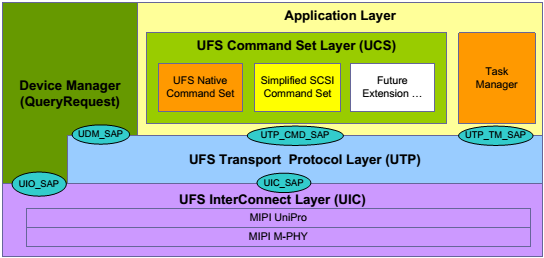

5 UFS ARCHITECTURE OVERVIEW
===
# 5.1 UFS Top level Architecture

Figure 5.1 shows the Universal Flash Storage (UFS) top level architecture.

  
**Figure 5.1 — UFS Top Level Architecture**

UFS communication is a layered communication architecture. It is based on SCSI SAM architectural model [SAM].

**Application Layer**  

[test link](#51-ufs-top-level-architecture)

The application layer consists of the UFS command set layer (UCS), the device manager and the Task Manager. The UCS will handle the normal commands like read, write, and so on. UFS may support multiple command sets. UFS is designed to be protocol agnostic. This version UFS standard uses SCSI as the baseline protocol layer. A simplified SCSI command set was selected for UFS. UFS Native command set can be supported when it is needed to extend the UFS functionalities.

The Task Manager handles commands meant for command queue control. The Device Manager will provide device level control like Query Request and lower level link-layer control.

**UFS Device Manager**

The device manager has the following two responsibilities:

* Handling device level operations.

* Managing device level configurations.

Device level operations include functions such as device sleep, device power down, power management and other device specific operations. These mainly involve power management of the device.

Device level configuration is managed by the device manager by maintaining and storing a set of descriptors. The device manager would handle commands like query request which is meant for modifying and retrieving configuration information of the device.

